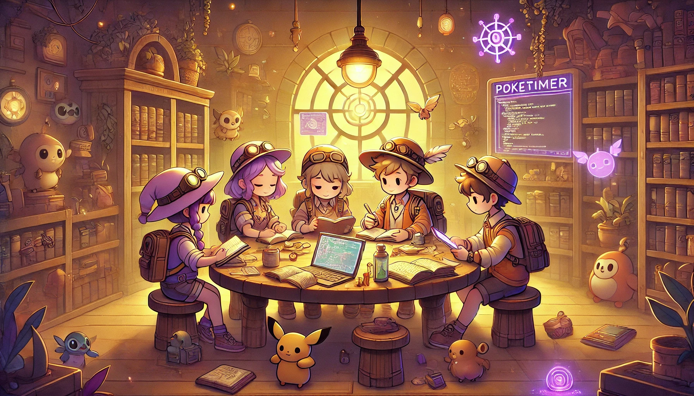
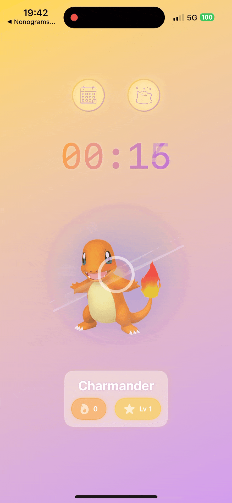
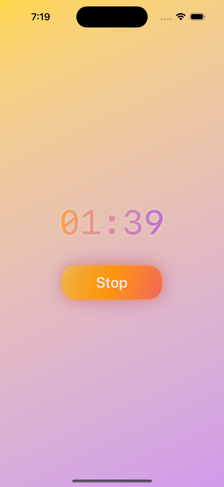
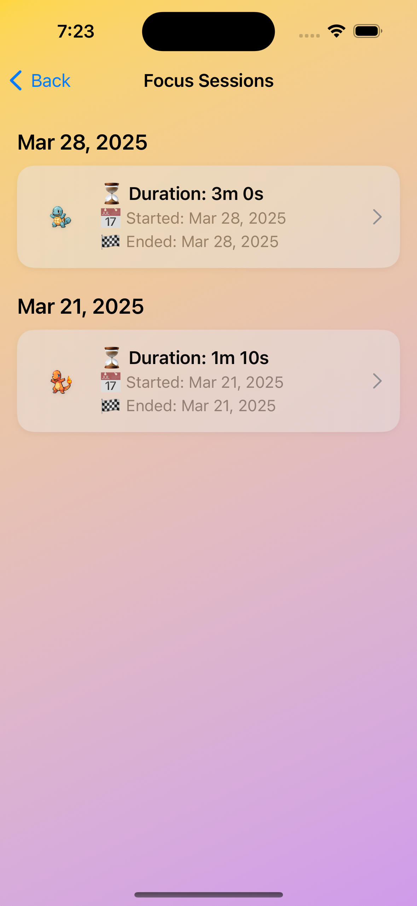
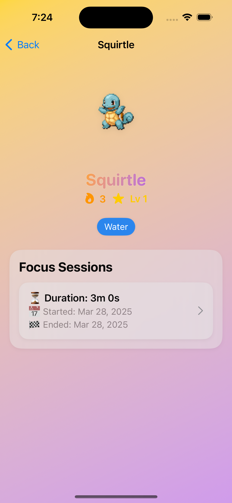

# PokeTimer

**PokeTimer** is a **Pokémon-themed Pomodoro app** that transforms productivity into a playful adventure. Complete focus sessions to earn XP, level up your Pokémon, and enjoy an engaging, animated interface inspired by the world of Pokémon.

---

## 🎨 Philosophy & Vision

PokeTimer is a small passion project that mixes productivity with a touch of nostalgia. The goal is simple: make staying focused a bit more enjoyable by adding a playful, familiar theme.

Instead of using strict systems or pressure-based rewards, the app invites users to focus at their own pace, while watching their Pokémon gradually grow with them. The interface is designed to be smooth, animated, and relaxing — something you will enjoy opening, even on tough days.

While still in early development, the long-term hope is to create a calm, visually engaging tool that motivates people gently, with no stress and no pressure — just good vibes and steady progress.

---

## 🧩 Key Features

### ⏱️ Pomodoro Mechanics
- Classic 25/5 Pomodoro cycle, with custom durations.
- Animated and immersive timer UI designed to feel fun and rewarding.

### 🧠 Gamification with Pokémon
- Choose a starter Pokémon (e.g., Bulbasaur, Charmander, or Squirtle).
- Earn **1 XP per minute** of focused work.
- Pokémon level up and evolve as you stay productive.
- Evolution and XP curves are inspired by the original Pokémon games.

### 💸 In-Game Currency & Encounters (Planned)
- Earn coins from sessions and milestones.
- Spend coins on items like Pokéballs.
- Trigger wild Pokémon encounters with item use.
- Catch rates vary depending on level or items used.

---

## 🎯 Design Highlights

- **UI/UX Focused:** 
  - Built with SwiftUI and custom gestures.
  - Smooth animations for session start, Pokémon switching, and timer configuration (e.g., turning a Pokéball to set duration).
  - Figma prototypes to refine experience.

- **Gesture-Based Interaction:**  
  - Swipe, tap, and rotate interactions for a tactile and magical experience.

- **Relaxing Experience:**
  - Designed to be stress-free and visually soothing.

---

## 🚧 Development Roadmap

### ✅ Phase 1 – Architecture & Core Features
- Struct-based architecture:
  - `Pokemon`, `PokemonSpecies`, `Session`, `PokemonManager`, `SessionManager`.
- `PersistenceManager` for saving/loading with JSON.
- Functional Pomodoro with:
  - Basic session tracking.
  - A view to list past sessions and Pokémon progress.
- First draft of UI wireframes with Figma.

### 🛠️ Phase 2 – UI Remake & PokeAPI Integration (In Progress)
- Replace mock assets with real **Pokémon sprites from the PokéAPI**.
- Add animations for:
  - Starting the timer.
  - Rotating the Pokéball to set duration.
  - Switching Pokémon.
- Add a first version of "Add new Pokémon" (pre-catch/buy feature).
- Refine visual design to be **playful, intuitive, and calm**.

### 🔧 Phase 3 – Testing & Dependency Injection (In Progress)
- Refactor app to support **Dependency Injection** for better testability.
- Add **unit tests** to core managers and view models.
- Clean and modular code organization.

### 🌱 Phase 4 – Gameplay & UX Expansion
- **Introduce rest sessions**:
  - Add proper support for break periods after focus sessions.
  - Define rest session logic and duration options (short/long breaks).

- Add **session categories and notes**:
  - Let users tag sessions with themed labels (e.g., “Read”, “Study”).
  - Allow notes per session, acting as a personal “Trainer Log”.

- Introduce **in-game currency system**:
  - Earn coins based on productivity milestones.
  - Use coins to purchase catching items (e.g., Pokéballs) for future encounters.

- Implement realistic **Pokémon evolution and collection system** using the PokéAPI:
  - Use real evolution levels and chains from the API.
  - Support adding and switching between multiple Pokémon.
  - Animate evolution transitions and growth milestones.

---

## 🧪 Tech Stack

- **Language:** Swift, SwiftUI
- **Architecture:** MVVM with Dependency Injection
- **Animations & Gestures:** Native SwiftUI with custom transitions
- **Data Persistence:** JSON-based via `PersistenceManager`
- **API Integration:** PokéAPI (REST)

---

## 📸 Previews

A few screenshots and animations showcasing the current user experience:

### 🌀 Interactive Home (ContentView)

- **Long press** on the Pokéball triggers **haptic feedback**, a **glow animation**, and starts the focus timer.
- While the timer is inactive, a **circular gesture** lets you **adjust the session duration**.
- **Swipe left/right** to switch between your Pokémon.
- Tap the **"End" button** to manually stop the session.

---
### ⏱️ Timer Running

- Once started, the session shows the elapsed time and the selected Pokémon.
- Minimal distraction — just you and your focus.

---

### ✅ Timer Completed

- When the session ends, XP is granted to the current Pokémon.
- A subtle animation marks the session completion.

---

### 📅 Session History

- A scrollable list of all your completed focus sessions.
- Each session includes the duration, date, and associated Pokémon.
- Designed as a logbook to reflect your productivity journey.

---

### 🧬 Pokémon List

- View all your Pokémon in one place.
- Shows XP, level, and progress for each.
- Use the **"＋ Add Pokémon"** button in the top navigation bar to grow your team (in future versions: catch or buy mechanics).

---

### 🔍 Pokémon Details

- See a detailed view of your selected Pokémon.
- Displays species, level, XP, and an animated image.
- Meant to feel like your personal Pokémon companion’s profile.

---

## 🔜 Next Steps

- Implement Dependency Injection fully and write unit tests.
- Complete UI refactor and make it accessible.
- Finalize gesture interactions and animations.
- Start building evolution and catching logic with real API data.

---

**Made with ❤️ by a Swift enthusiast and Pokémon fan.**
